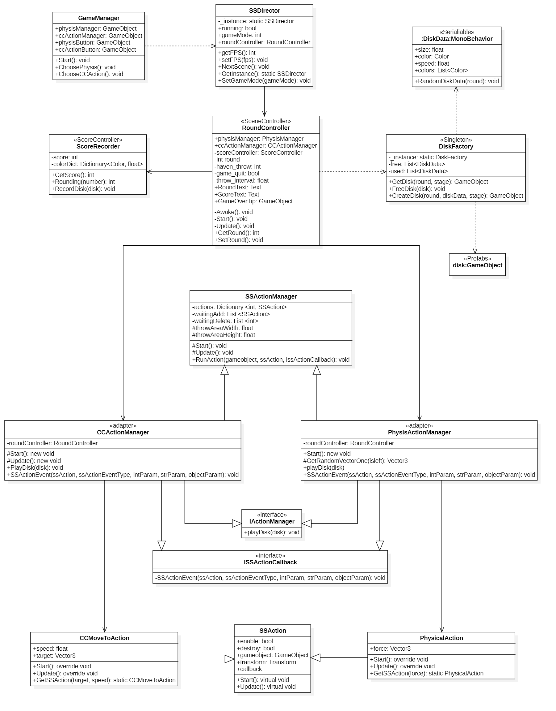
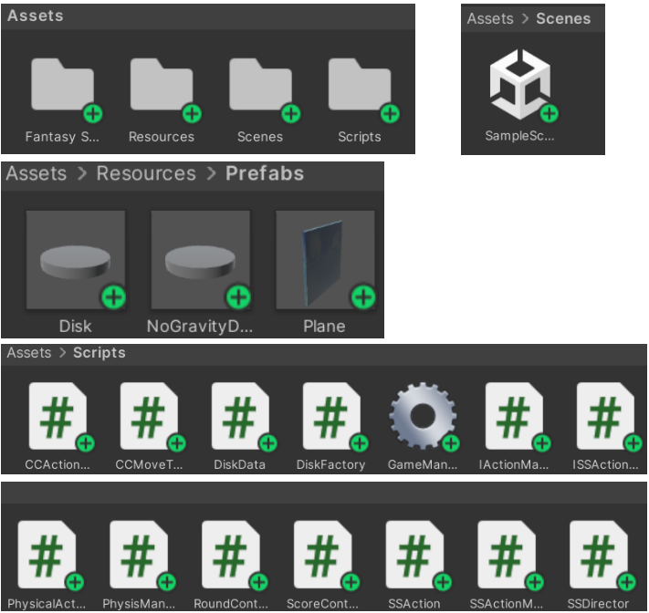
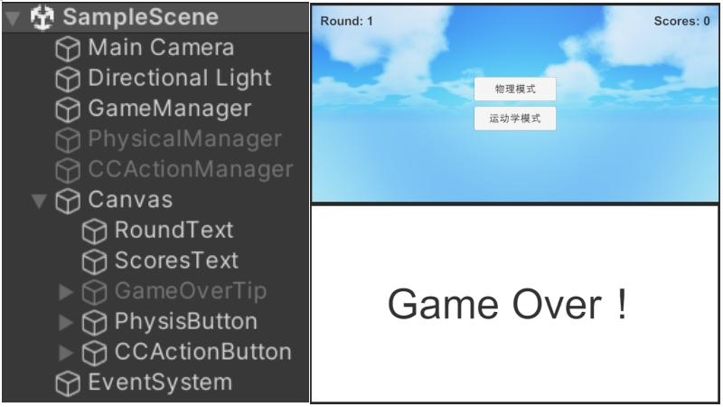
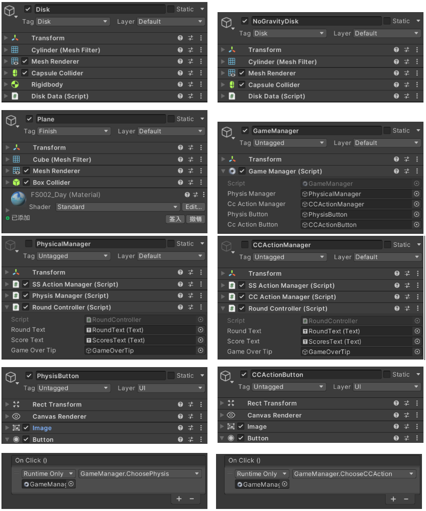

# 【 Unity 】《 鼠标打飞碟》 - Lab 4 博客 

Video URL：

---

## 一、游戏要求 

游戏内容要求：

1. 游戏有 n 个 round，每个 round 都包括 10 次 trial;

2. 每个 trial 的飞碟的色彩、大小、发射位置、速度、角度、同时出现的个数都可能不同;

3. 每个 trial 的飞碟有随机性，总体难度随 round 上升;

4. 鼠标点中得分，得分规则按色彩、大小、速度不同计算，得分规则自由设定。

游戏实现要求：

1. 尽可能使用前面 MVC 结构实现人机交互与游戏模型分离；
2. 使用带缓存的工厂模式管理不同飞碟的生产与回收，该工厂必须是场景单实例的；
3. 按 adapter模式 设计图修改飞碟游戏；

4. 使该飞碟游戏同时支持物理运动与运动学（变换）运动。

## 二、游戏设计 

游戏内容设计：

1. 该游戏有 10 个 round，每个 round 都包括 10 次 trial;

2. 每个 trial 的飞碟的色彩、大小、发射位置、速度、角度、同时出现的个数都可能不同;
3. 每个 trial 的飞碟有随机性，总体难度随 round 上升;

```cs
  // DiskData -> 飞碟的色彩、大小、速度不同
  public List<Color> colors = new List<Color>() { Color.green, Color.red, Color.yellow };

  public void RandomDiskData(int round)
  {
      this.size = Random.Range(1f - round * 0.03f, 1f);
      this.color = colors[Random.Range(0, 3)];
      this.speed = Random.Range(15f, 15f + round * 0.5f);
  }

  // CCActionManager -> 飞碟的发射位置、角度不同
  public void PlayDisk(GameObject disk)
  {
      Vector3 position;
      Vector3 target;
      DiskData diskData = disk.GetComponent<DiskData>();
  
      // classification 0: The disk appears over;
      // classification 1: The disk appears below;
      // classification 2: The disk appears on the left;
      // classification 3: The disk appears on the right;
      int classification = Random.Range(0, 4);
      switch (classification)
      {
          case 0:
              {
                  position = new Vector3(Random.Range(-throwAreaWidth, throwAreaWidth), throwAreaHeight * 3);
                  target = new Vector3(Random.Range(-throwAreaWidth, throwAreaWidth), -throwAreaHeight * 3);
                  disk.transform.position = position;
                  CCMoveToAction ccMoveToAction = CCMoveToAction.GetSSAction(target, diskData.speed * 0.75f);
                  this.RunAction(disk, ccMoveToAction, this);
                  break;
              }
          case 1: ...
          case 2: ...
          case 3: ...
      }
  }

  // PhysisManager -> 飞碟的发射位置、角度不同
  protected Vector3 GetRandomVectorOne(bool isleft)
  {
      Vector3 vector = new Vector3(0f, 0f, 0f);
      while (vector.y <= 0f)
      {
          if (isleft)  // throw from left
          {
              vector.x = UnityEngine.Random.Range(0f, 1f);
          }
          else  // throw from right
          {
              vector.x = UnityEngine.Random.Range(-1f, 0f);
          }
          vector.y = Mathf.Sqrt(1 - vector.x * vector.x) * 0.7f;
      }
      return vector;
  }
  
  public void PlayDisk(GameObject disk)
  {
      Vector3 position;
      DiskData diskData = disk.GetComponent<DiskData>();
  
      // classification 0: The disk appears on the left;
      // classification 1: The disk appears on the right;
      int classification = Random.Range(0, 2);
      switch(classification)
      {
          case 0:
              {
                  position = new Vector3(-throwAreaWidth, Random.Range(-throwAreaHeight, throwAreaHeight));
                  disk.transform.position = position;
                  PhysicalAction physicalAction = PhysicalAction.GetSSAction(GetRandomVectorOne(true) * diskData.speed);
                  this.RunAction(disk, physicalAction, this);
                  break;
              }
          case 1:
              {
                  position = new Vector3(throwAreaWidth, Random.Range(-throwAreaHeight, throwAreaHeight));
                  disk.transform.position = position;
                  PhysicalAction physicalAction = PhysicalAction.GetSSAction(GetRandomVectorOne(false) * diskData.speed);
                  this.RunAction(disk, physicalAction, this);
                  break;
              }
      }
  }

  // RoundController -> 飞碟的同时出现的个数不同
  int times = Random.Range(1, 4);
  if (SSDirector.GetInstance().gameMode == 0)
  {
      while (times-- > 0)
      {
          physisManager.PlayDisk(DiskFactory.GetInstance().GetDisk(round, 0));
      }
  }
  else
  {
      while(times-- > 0)
      {
          ccActionManager.PlayDisk(DiskFactory.GetInstance().GetDisk(round, 1));
      }
  }
```

4. 鼠标点中得分，得分规则按色彩、大小、速度不同计算，得分规则设定与飞碟点击判定如下：

```cs
  // ScoreController -> 得分规则设定
  Dictionary<Color, float> colorDict = new Dictionary<Color, float>() {
      { Color.green, 0.5f},
      { Color.red, 1f},
      { Color.yellow, 1.5f}
  };

  public int Rounding(float number)
  {
      int results = (int)number;
      if (number - results >= 0.5f)
      {
          results += 1;
      }
      return results;
  }
  
  public void RecordDisk(GameObject disk)
  {
      DiskData diskData = disk.GetComponent<DiskData>();
      score += Rounding(colorDict[diskData.color] + (1.1f - diskData.size) * 4 + (diskData.speed - 14f) * 0.3f);
  }

  // RoundController -> 飞碟点击判定
  void Update()
  {
      ...
      if (Input.GetMouseButtonDown(0))  // 0 for left-click
      {
          // Creates a ray that emits from the camera to the location of the mouse pointer
          Ray ray = Camera.main.ScreenPointToRay(Input.mousePosition);
          RaycastHit hit;
      
          // Detect the collision of the ray with an object in the scene
          if (Physics.Raycast(ray, out hit))
          {
              // Check if the colliding object is the current object
              if (hit.collider != null)
              {
                  if (hit.collider.gameObject.tag.Contains("Disk"))
                  {
                      Debug.Log("Hit UFO!");
                      this.scoreController.RecordDisk(hit.collider.gameObject);
                      hit.collider.gameObject.SetActive(false);
                      ScoreText.text = "Scores: " + scoreController.GetScore().ToString();
                  }
                  if (hit.collider.gameObject.tag.Contains("Finish"))
                  {
                      Debug.Log("Game Over!");
                      game_quit = true;
                      GameOverTip.SetActive(true);
                  }
              }
          }
      }
  }
```

游戏实现设计：

1. 尽可能使用前面 MVC 结构实现人机交互与游戏模型分离；
2. 使用带缓存的工厂模式管理不同飞碟的生产与回收，该工厂必须是场景单实例的；
3. 按 adapter模式 设计图修改飞碟游戏；

该游戏项目的 UML图 如下图所示：


4. 使该飞碟游戏同时支持物理运动与运动学（变换）运动。

## 三、游戏实现

此处仅展示部分游戏实现，其余详见代码；

1. 该游戏的项目结构，场景效果，游戏对象及其挂载的组件详情如下图所示： 







由此可知，在运动学模式中，飞碟 (Disk) 使用了刚体部件；

同时，地面 (Plane) 使用了 "Finish" Tag，与地面 (Plane) 相关的代码已在上一部分的 飞碟点击判定 代码中给出；

2. 飞碟运动逻辑与相关代码：

```cs
// CCMoveToAction -> 物理模式飞碟运动
public static CCMoveToAction GetSSAction(Vector3 target, float speed)
{
    CCMoveToAction action = ScriptableObject.CreateInstance<CCMoveToAction>();
    action.target = target;
    action.speed = speed;
    return action;
}

public override void Update()
{
    this.transform.position = Vector3.MoveTowards(this.transform.position, target, speed * Time.deltaTime);
    ...
}

// PhysicalAction -> 运动学模式飞碟运动
public static PhysicalAction GetSSAction(Vector3 force)
{
    PhysicalAction action = ScriptableObject.CreateInstance<PhysicalAction>();
    action.force = force;
    return action;
}

public override void Start()
{
    Rigidbody rb = this.gameobject.GetComponent<Rigidbody>();
    rb.AddForce(force.x, force.y, force.z, ForceMode.Impulse);
}
```
由此可知，在运动学模式中，飞碟 (Disk) 可做弧线运动；

3. DiskFactory

```cs
  public class DiskFactory : MonoBehaviour
  {
      private static DiskFactory _instance;
  
      private List<DiskData> used = new List<DiskData>();
      private List<DiskData> free = new List<DiskData>();
  
      public static DiskFactory GetInstance()
      {
          if (_instance == null)
          {
              _instance = new DiskFactory();
          }
          return _instance;
      }
  
      public GameObject CreateDisk(int round, DiskData diskData, int stage)
      {
          GameObject disk;
          if(stage == 0)  // Physis
          {
              disk = GameObject.Instantiate(Resources.Load("Prefabs/Disk", typeof(GameObject))) as GameObject;
          }
          else  // CCAction
          {
              disk = GameObject.Instantiate(Resources.Load("Prefabs/NoGravityDisk", typeof(GameObject))) as GameObject;
          }
  
          if (diskData == null)
          {
              disk.GetComponent<DiskData>().RandomDiskData(round);
              diskData = disk.GetComponent<DiskData>();
          }

          used.Add(diskData);  // add the diskData to the cache

          // Instantiate disk size
          disk.transform.localScale = new Vector3(2, 0.15f, 2) * diskData.size;
          // Instantiate disk color
          Renderer renderer = disk.GetComponent<Renderer>();
          renderer.material.color = diskData.color;
  
          return disk;
      }

      // Called when the round is changed
      public void Reset()
      {
          used.Clear();
          free.Clear();
      }
  
      // stage = 0 -> Physis，Disk
      // stage = 1 -> CCAction，NoGravityDisk
      public GameObject GetDisk(int round, int stage)
      {
          DiskData diskData = null;
          if (free.Count > 0)
          {
              diskData = free[Random.Range(0, free.Count)];
              free.Remove(diskData);
          }
          return CreateDisk(round, diskData, stage);
      }
  
      // Called in SSActionEvent()
      public void FreeDisk(GameObject disk)
      {
          DiskData diskData = disk.GetComponent<DiskData>();
          Destroy(disk);
          free.Add(diskData);
          used.Remove(diskData);
      }
  }
```
   
4. ScoreController

```cs
  public class ScoreController : MonoBehaviour
  {
      private int score = 0;
      Dictionary<Color, float> colorDict = new Dictionary<Color, float>() {
          { Color.green, 0.5f},
          { Color.red, 1f},
          { Color.yellow, 1.5f}
      };
  
      public int GetScore()
      {
          return score;
      }
  
      public int Rounding(float number)
      {
          int results = (int)number;
          if (number - results >= 0.5f)
          {
              results += 1;
          }
          return results;
      }
  
      public void RecordDisk(GameObject disk)
      {
          DiskData diskData = disk.GetComponent<DiskData>();
          score += Rounding(colorDict[diskData.color] + (1.1f - diskData.size) * 4 + (diskData.speed - 14f) * 0.3f);
      }
  }
```

ScoreController 仅涉及对 Model 的处理，而 RoundController 涉及对 Model、View 与 Controller 的处理；

将 ScoreController 的计分逻辑从 RoundController 的回合控制逻辑中分离，使得该游戏的项目结构更加直观且易于维护；
